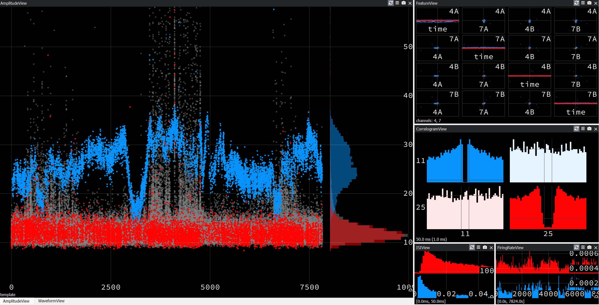

# Tetrode Processing




This repo houses the processing pipeline for electrode data visualization.


## Setup

To get started, first we will set up the necessary conda environments. Make sure you have anaconda installed.

### SpikeSorting

To set up the spike sorting environment:

Within the anaconda prompt:
1. run ```conda create --name SpikeSorting python=3.9```
2. run ```conda activate SpikeSorting```
3. run ```python -m pip install kilosort[gui] mountainsort5 pandas```
4. HIGHLY RECOMMENDED: If you have an nvidia GPU, it is highly recommended you install pytorch. Using pytorch allows for ultra-fast spike sorting using GPU capabilities for kilosort4
    - run ```pip uninstall torch```
    - run: ```conda install pytorch pytorch-cuda=11.8 -c pytorch -c nvidia``` 
    - only works with windows and linux computers with nvidia GPU
4. run ```pip install spikeinterface```

### Phy 2

To set up the visualization environment:

Within the anaconda prompt:

1. run ```conda create -n phy2 -y python=3.11 cython dask h5py joblib matplotlib numpy pillow pip pyopengl pyqt pyqtwebengine pytest python qtconsole requests responses scikit-learn scipy traitlets```
2. run ```conda activate phy2```
3. run ```pip install git+https://github.com/cortex-lab/phy.git```
4. run ```pip install klusta klustakwik2```

## Usage

1. navigate to the project folder within your anaconda prompt
2. run ```conda activate SpikeSorting```
2. run ```python sort.py -p "enter path to your data" -s "enter path to your saved results" -a "enter name of sorting algorithm"```
    - options for sorting algorithms currently include "kilosort4", "spykingcircus2", and "mountainsort5"
    - Kilosort4 is recommended. Fast runtime, and preprocessing, postprocessing, and export to Phy are handled internally (leaving less room for spikeinterface bugs). Highest performance as determined by number of units with low contamination.
3. run ```conda activate phy2```
4. run ```phy template-gui path_to_your_phy_python_file```
    - sort.py will automatically export to phy and, for mountainsort and spykingcircus, provide the command to open results with phy for you. If you do not see this command, run the above command replacing path_to_your_phy_python_file with the path to the params.py file you see within your saved results 

Have fun spike sorting!