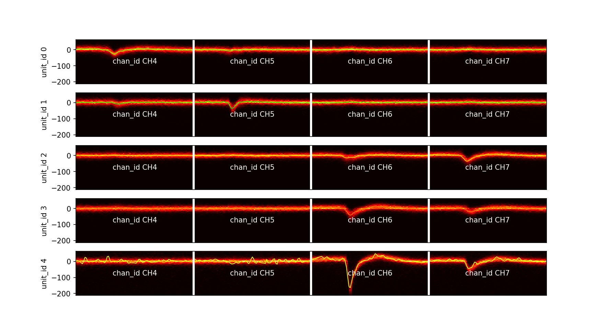

# Tetrode Processing

This repo houses the processing pipeline for electrode data visualization. Currently under development

- trace visualization
- sorting
- spike train visualization
- waveform visualization
- quality metric visualization
- spike count histogram